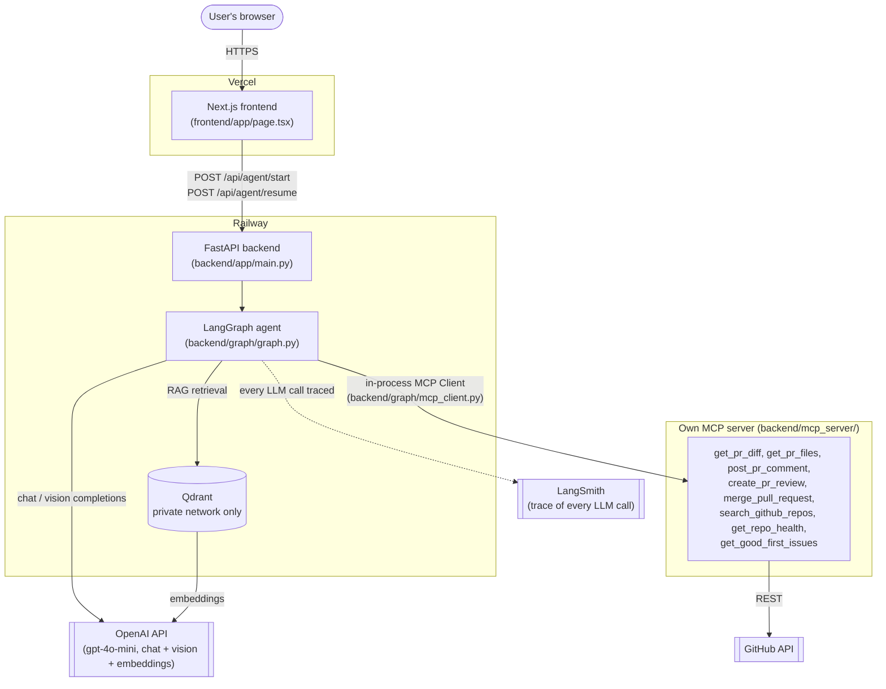
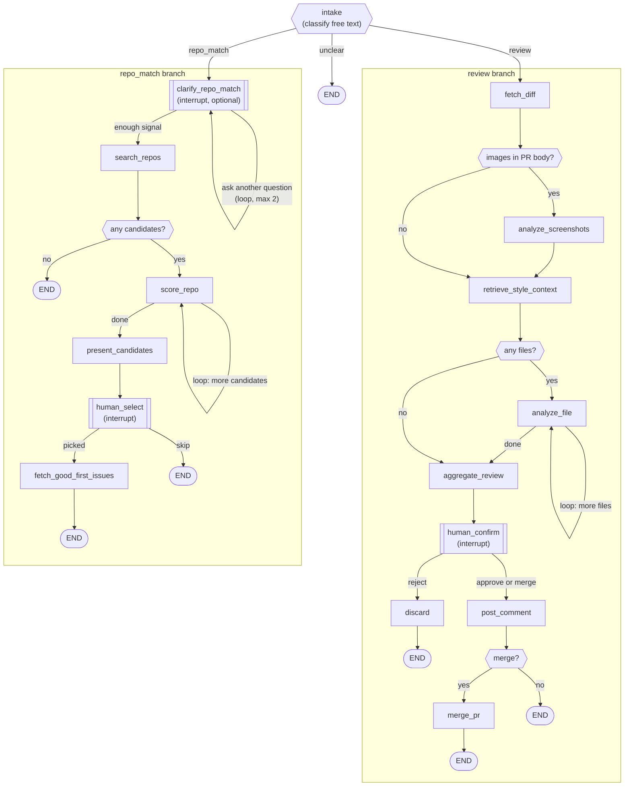

# ARCHITECTURE.md

## 1. What this is, in 60 seconds

OSS Copilot is one AI agent that does two things for open-source contributors: it
reviews a GitHub pull request file-by-file and, only after a human approves the draft,
posts the comment — and it helps someone find an open-source repo worth contributing to,
ranked by how contributor-friendly it actually is (not just star count). Both are the
same LangGraph graph; a free-text request is classified into one branch or the other.
Nothing gets written to GitHub or presented as final without a human confirming it first.

## 2. System diagram

The agent never talks to GitHub or OpenAI directly from a node function — every call
goes through either the MCP tool layer (GitHub) or `langchain_openai.ChatOpenAI` /
a `@traceable`-wrapped embedding call (OpenAI), which is also why every LLM call shows
up in LangSmith without each node having to opt in individually.

## 3. One request, start to finish

Walking a single "review this PR" request through the whole stack:

1. **Browser → frontend.** User types a PR URL into the textarea on
   `oss-copilot-dmitriy-solo.vercel.app` and submits. `frontend/app/page.tsx` POSTs
   `{"message": "..."}` to `NEXT_PUBLIC_API_URL/api/agent/start`.
2. **Frontend → backend.** `backend/app/main.py` generates a `thread_id` (UUID),
   calls `review_app.ainvoke({"user_request": message}, config={"thread_id": ...})`,
   and returns whatever the graph produces — either a final result or an
   interrupt payload.
3. **`intake` node** (`backend/graph/nodes_intake.py`) sends the free text to
   gpt-4o-mini with structured output, asking it to classify the request and pull out
   `owner`/`repo`/`pr_number` (or a search query, for the other branch). This is the
   graph's one real branch point: `route_after_intake` sends execution to `fetch_diff`
   (review), `clarify_repo_match` (repo_match), or straight to `END` (unclear).
4. **`fetch_diff`** calls the MCP tools `get_pr_diff` and `get_pr_files` — through
   `backend/graph/mcp_client.py`, which holds an in-process `mcp.Client` bound to the
   server object directly (no subprocess, no network hop: same process, real MCP
   protocol framing). Those tools hit the real GitHub REST API. The diff and PR
   description are also scanned right here for prompt-injection patterns
   (`backend/graph/guardrails.py`) and image URLs (`backend/graph/vision.py`).
5. **`analyze_screenshots`** (conditional — only if the PR body had images) sends each
   one to gpt-4o-mini's vision endpoint.
6. **`retrieve_style_context`** embeds a fixed query ("contribution guidelines, coding
   conventions...") and searches Qdrant, filtered to this repo, for relevant
   README/CONTRIBUTING chunks — the RAG grounding for the review.
7. **`analyze_file`** loops over each changed file (capped at 10): for each one with a
   real patch, it checks an on-disk cache first (`backend/graph/cache.py`, keyed on the
   file content + prompt version), and on a miss calls `_review_with_fallback`, which
   tries gpt-4o-mini with a 20s timeout and falls back to gpt-4o on a retryable failure.
   The model returns each comment as a quote of the exact diff line it concerns
   (`code_line`) plus the comment text — `_review_with_fallback` resolves that quote to
   a real line number itself, by parsing the diff's hunk headers
   (`_new_file_line_map`/`_resolve_comment_line`), rather than trusting the model to
   compute the line number (measured to be off by 1-2 lines even on a single simple
   hunk — an LLM doing arithmetic it's bad at, done in code instead).
8. **`aggregate_review`** groups comments by file, pairs each file's actual diff with
   its line-anchored comments, redacts anything secret-shaped in the whole assembled
   draft (diff included, not just the model's prose), and appends any screenshot
   analysis.
9. **`human_confirm`** calls `langgraph.types.interrupt()` — this is where node 2's
   `ainvoke()` actually returns, with `{status: "interrupt", payload: {...}}`, back
   through the backend to the frontend.
10. **Frontend shows the draft** and a text input. The human types "approve", "merge",
    or "reject"; the frontend POSTs `{"thread_id", "answer"}` to `/api/agent/resume`.
    The reply is parsed strictly against known aliases for those three — anything else
    re-triggers `interrupt()` with an `error` field instead of silently defaulting to
    "reject" (an earlier bug: any unrecognized reply, e.g. a typo, discarded the review
    without telling the reviewer why).
11. **Backend resumes the SAME graph run** via `Command(resume=answer)` against the
    same `thread_id` — LangGraph's checkpointer (`InMemorySaver`) picks up exactly where
    `human_confirm` left off. `route_after_human_confirm` sends "approve" and "merge"
    both to `post_comment` and "reject" to `discard`. `post_comment` calls the MCP
    `create_pr_review` tool (`event: APPROVE`) — a real GitHub review status on the PR,
    not a plain comment — so there's a review trail even when merging. GitHub hard-blocks
    approving your own PR (422 "Can not approve your own pull request", verified live);
    `post_comment` catches exactly that case and falls back to the plain `post_pr_comment`
    tool with an explicit "✅ Approved via OSS Copilot" prefix, since there's no native
    approval badge to rely on there. `route_after_post_comment` then sends "merge" on to
    `merge_pr` (the MCP `merge_pull_request` tool). GitHub declining to merge — conflicts,
    unmet required reviews/checks — comes back as data (`merged: false` + message), not an
    exception: the review/comment was already posted, so that's a partial success to
    report, not a crash.
12. **Final result flows back** through backend → frontend → the user sees the posted
    comment link, the merge outcome, or the discard note.

Every OpenAI call in steps 3, 5, 6, 7 is traced in LangSmith automatically; every step
that touches GitHub goes through the MCP tool layer, never a bare `httpx` call from a
graph node.

## 4. The graph's control flow

All three loops are bounded (files capped at 10 in `fetch_diff`; candidates capped at 5
in `search_repos`; clarifying questions capped at `MAX_CLARIFY_TURNS = 2` in
`clarify_repo_match`), so none can run away. All three interrupts use the identical
mechanism (`langgraph.types.interrupt()` + `Command(resume=...)`), so the frontend and
the HTTP API layer only need to handle one generic "interrupt / resume" shape, not
three — they switch on `payload["type"]` (`review_confirmation` / `repo_selection` /
`clarifying_question`) purely for presentation (icon, quick-action buttons), never for
control flow.

## 5. Component independence and where coupling was chosen on purpose

| Component | Independent? | Notes |
|---|---|---|
| LLM provider | Mostly | Every call goes through `langchain_openai.ChatOpenAI` with a `model=` string — swapping to Anthropic/Gemini means changing the import and the model string, not the graph logic. Actually exercised in stage 10's A/B test (gpt-4o-mini vs gpt-4o) with zero graph changes. |
| Vector DB (Qdrant) | Yes, behind `backend/rag/vector_store.py` | Nothing outside that one file knows it's Qdrant specifically — `search`/`upsert_chunks`/`ensure_collection` are the only surface other code touches. Confirmed by a second, independently-added ingest path: `backend/rag/document_ingest.py` (PDF/DOCX style guides) goes through the exact same `upsert_chunks`/collection, so `retrieve_style_context` didn't need a single line changed to start grounding reviews in an uploaded style guide alongside README/CONTRIBUTING. |
| GitHub | **Deliberately coupled** | The MCP tool layer's tool *signatures* (`get_pr_diff`, `post_pr_comment`, etc.) are GitHub-shaped on purpose — swapping to GitLab would mean rewriting `backend/mcp_server/github_client.py` and the tool bodies, not just a config value. This was a conscious choice: building a provider-agnostic abstraction with only one real backend (GitHub) would have been speculative generality with no second caller to validate it against. |
| MCP server ↔ graph | Loosely coupled by protocol, tightly coupled by tool names | `backend/graph/mcp_client.py` talks to the server through the real MCP protocol (not a direct function import), so the server could run as a separate process/deployment without any graph code changing — but the graph's node functions hardcode the specific tool names and argument shapes, so the two still can't evolve independently without coordination. |
| Frontend ↔ backend | Yes | Plain HTTP + JSON, generic interrupt/resume shape (§4) — the frontend has no knowledge of what `review_confirmation` vs `repo_selection` payloads mean beyond displaying `draft_comment`/`candidates` and `instructions`. A different frontend (mobile app, CLI) could drive the same two endpoints unmodified. |
| Cache / fallback / guardrails | Layered on top, not baked in | `analyze_file` (the graph node) wraps `review_file()` with caching and fallback; `review_file()` itself stays a plain, cache-free, fallback-free function so `backend/evals/*.py` can call it directly and always get a fresh, unmediated model response. This is the one place independence was chosen specifically *for evals' sake* — see EVALS.md and PROGRESS.md stage 13.

## 6. Key decisions and why (cross-references, not a repeat)

This file is the map; the reasoning with real numbers lives where the decision was
actually made and tested:

- **Why LangGraph, not CrewAI/Parlant; why gpt-4o-mini, not gpt-4o** — PLAN.md §2.4,
  and the actual empirical A/B result — EVALS.md §7.
- **Chunking/embedding/vector DB choices for RAG** — PLAN.md §2.2, pipeline built in
  PROGRESS.md stage 4.
- **Document parsing beyond Markdown (PDF/DOCX)** — done: `backend/rag/document_ingest.py`,
  PROGRESS.md 2026-09-16. The stage-4 RAG pipeline only ever parsed plain Markdown
  (README/CONTRIBUTING via the GitHub API) — this was a real, separate gap against the
  ТЗ's document-processing requirement (distinct from the RAG-pipeline requirement
  itself) until an explicit audit against the checklist caught it.
- **Temperature/max_tokens/top_p** — decided from real experiment data, not guessed —
  EVALS.md §8.
- **Why exact-match caching, not semantic caching** — `backend/graph/cache.py`
  docstring and PROGRESS.md stage 13: a diff's review is exact-content-sensitive, so a
  similarity cache risks confidently serving the wrong review for a diff that merely
  looks like one already seen.
- **Guardrails design** — `backend/graph/guardrails.py` docstring and PROGRESS.md
  stage 12: detection (not blocking) for prompt injection, because there's no regex
  that reliably distinguishes "code that mentions 'ignore'" from an actual attack;
  redaction (not just flagging) for secrets, because even a correct "this file has a
  hardcoded key" comment shouldn't quote the key into a public thread.

## 7. Trade-offs and hypotheses that didn't survive contact

- **File-by-file review vs. whole-PR review.** `analyze_file` sees one file's patch at
  a time, not the full PR. This is why `clean-08` in the golden dataset is a genuine
  known limitation, not a model failure (EVALS.md §5) — the model can't see a test file
  added elsewhere in the same PR. Chosen anyway because it bounds each LLM call's size
  and lets the loop/cache/fallback machinery operate per-file rather than per-PR.
- **In-process MCP client, not a subprocess or networked server.** Simpler to run and
  debug, and avoids a second process to deploy — at the cost of the graph and the MCP
  server always living in the same Python process. Acceptable because this project
  doesn't need the MCP server to be independently scaled or reused by a different
  client.
- **`InMemorySaver` checkpointer in production.** Human-in-the-loop state lives in
  process memory, not a database — a backend restart mid-review loses any pending
  approval. Accepted for now because Railway's single-instance deploy makes this a
  minor, known gap rather than an active data-loss risk; a real multi-instance
  deployment would need a persistent checkpointer (Postgres/Redis) instead.
- **Hypothesis that didn't hold: "the stronger model will out-perform gpt-4o-mini on
  review quality."** The actual A/B result (EVALS.md §7) showed gpt-4o-mini matching or
  beating gpt-4o on the LLM-as-judge score while being ~23x cheaper — the assumption
  that a bigger model is straightforwardly better for this specific, narrow task turned
  out to be wrong on the data collected.

## 8. Deployment topology

Covered in detail in README.md's "Деплой" section — summary: Vercel (frontend, static
Next.js build) → Railway (`backend` service, Docker, `$PORT`-aware) → Railway (`qdrant`
service, private network only, persistent volume). PROGRESS.md's stage-17 entry has the
full account of what went wrong getting there (six real, live-tested bugs, not
hypothetical ones) and how each was fixed.
